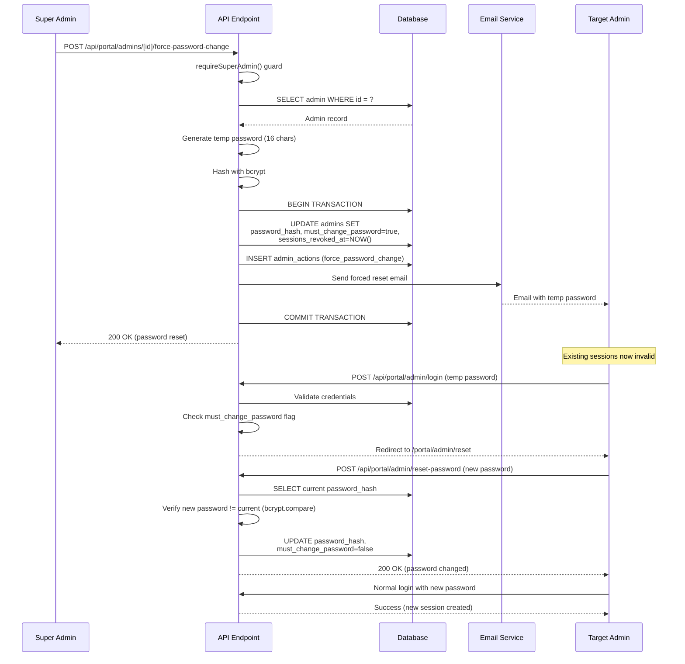
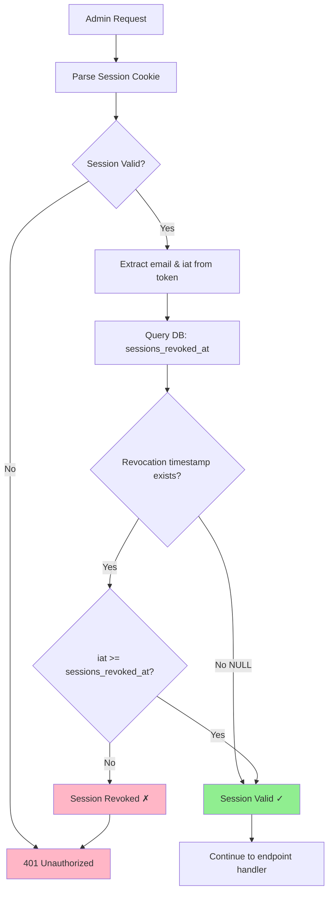

## Summary

The portal is a single-repo setup with a Next.js frontend and Next.js API routes for backend functionality. The frontend handles routing and UI, while the API routes provide authenticated access, data updates, and audit logging. For local development we use MariaDB; production auth is handled via email/password with cookie sessions.

## Components

- **Frontend (Next.js)**: `src/pages/portal/*` for portal routes and `src/components/Portal/*` for UI.
- **Backend API (Next.js API routes)**: `src/pages/api/portal/*` for API endpoints.
- **Database (MariaDB)**: primary source of truth for participants, teams, results, and logs.
- **Admin scripts**: `backend/scripts/admin/*` for operational tooling (create super admin).

## Request Flow

1. User visits `/portal` and selects participant or admin.
2. Frontend calls backend API for auth flow (magic link for participants, managed auth for admins).
3. Backend validates auth, issues session, and serves protected data.
4. Frontend renders participant or admin views using API responses.
5. Admins can open a participant preview view from the admin dashboard.

## Environments

- **Local**: Frontend + backend + local MariaDB with seeded sample data.
- **Staging**: MariaDB with seeded sample data.
- **Production**: MariaDB with live data and admin-managed imports.

## Test Automation (BDD)

- Test scripts auto-create and drop `<db>_test` after successful runs.
- On failures, the test database is preserved for debugging.

## Security

- Admin auth uses email/password with cookie-based sessions (6-hour idle timeout).
- Participant login uses single-use magic links (30-minute expiry) that create a 48-hour session.
- Audit log records admin edits and imports.
- API routes enforce admin session checks where required.
- Session revocation system allows immediate invalidation of all admin sessions for security breach scenarios.
- Force password change feature enables super admins to reset other admin passwords with session revocation.

### Auth Guard Await Requirement

All auth guard functions (`requireSuperAdmin`, `requireAdmin`, `requireParticipantMatchOrAdmin`) are **async** and **MUST** be called with `await`. Omitting `await` causes a silent authentication bypass.

**Correct usage:**
```javascript
const payload = await requireSuperAdmin(req, res);
if (!payload) return;
```

**What goes wrong without `await`:**
- The return value is a `Promise` object, which is always truthy.
- The `if (!payload) return` guard never triggers -- any request passes authentication.
- `payload.email`, `payload.role`, etc. are all `undefined` (they are Promise properties, not session data), causing downstream errors such as "Column 'admin_email' cannot be null."

**Enforcement:** `tests/unit/auth-guard-await.test.js` performs static analysis on all 11 API route files to verify every call to an auth guard is preceded by `await`. This test fails the build if any call site is missing the keyword.

## Proposed Auth Flows (text graphics)

Participant magic link (no user enumeration):

```
Browser -> Next.js UI -> Backend API -> Auth provider -> Email
   |            |             |              |             |
   |  submit    |             |              |             |
   | email      |             |              |             |
   |----------->|  POST /auth/participant/start          |
   |            |--------------------------------------->|
   |            |             |     create magic link     |
   |            |             |------------------------->|
   |            |             |    send email link        |
   |            |             |<-------------------------|
   |  always show "check your email" acknowledgement     |
   |<-----------|                                             |
```

Admin email/password auth:

```
Browser -> Next.js UI -> Backend API -> Session Cookie
   |            |                 |               |            |
   | login      |                 |               |
   |----------->|  POST /api/portal/admin/login   |
   |            |------------------------------->|
   |            |     validate + set cookie       |
   |            |<-------------------------------|
   |  route to /portal/admin                                  |
   |<-----------|                                             |
```

Admin view-as participant (preview):

```
Browser -> Admin UI -> Backend API -> Database
   |          |            |            |
   | select   |            |            |
   | participant           |            |
   |----------> open preview           |
   |          | GET /admin/view-as/:pid |
   |          |----------------------->|
   |          |   authorized read       |
   |          |<-----------------------|
   |    render participant view (read-only) |
```

## Admin Preview UX (minimal)

Goal: allow admins to see participant views without role changes or writes.

UI behaviors:

- Always show a top banner: "Preview mode — you are viewing this as admin."
- Provide a clear "Exit preview" action back to the admin dashboard.
- Render all participant fields in read-only mode (no edit controls).
- Show context chip with participant name and PID.

Acceptance criteria (BDD-style):

- Given I am an admin, when I open "View as participant", then I see a preview banner.
- Given I am in preview mode, when I attempt to edit a field, then editing is disabled.
- Given I am in preview mode, when I click "Exit preview", then I return to the admin dashboard.
- Given I am in preview mode, then I can see participant scores and lanes but cannot modify them.

## MVP Endpoints (current)

- `POST /api/portal/admin/login`
- `GET /api/portal/admin/session`
- `GET /api/portal/admin/refresh`
- `POST /api/portal/admin/import-xml`
- `POST /api/portal/participant/login`
- `GET /api/portal/participant/verify`
- `GET /api/portal/participant/session`
- `POST /api/portal/participant/logout`
- `GET /api/portal/participants/:pid`
- `GET /api/portal/participants?search=`
- `PATCH /api/portal/participants/:pid`
- `GET /api/portal/participants/:pid/audit`
- `POST /api/portal/admin/logout`
- `GET /api/portal/admin/admins`
- `POST /api/portal/admin/admins`
- `GET /api/portal/admin/audit`
- `DELETE /api/portal/admin/audit`
- `POST /api/portal/admins/:id/force-password-change`
- `POST /api/portal/admin/import-lanes`
- `GET /api/portal/admin/lane-assignments`
- `GET /api/portal/admin/possible-issues`
- `POST /api/portal/admin/import-scores`
- `GET /api/portal/teams/:teamSlug`
- `GET /api/portal/scores`
- `GET /api/portal/admin/optional-events`
- `GET|PUT /api/portal/admin/scores/visibility`
- `GET|PUT /api/portal/admin/optional-events/visibility`
- `GET|PUT /api/portal/admin/scratch-masters/visibility`

## Proposed API Contracts (initial)

All responses are JSON. Error messages for auth should be generic.

`POST /api/portal/admin/login`

Request:
```
{
  "email": "string",
  "password": "string"
}
```

Response (always success):
```
{
  "ok": true,
  "email": "string",
  "role": "super-admin | tournament-admin | results-manager"
}
```

`GET /api/portal/admin/session`

Request:
```
{
{
  "ok": true,
  "admin": {
    "email": "string",
    "role": "string"
  }
}
```

`GET /api/portal/participants/:pid`

Response:
```

`GET /portal/admin/preview/:pid` (UI route)

Response:
```
{
  "mode": "admin-preview",
  "participant": {
    "pid": "string",
    "firstName": "string",
    "lastName": "string",
    "email": "string",
    "phone": "string",
    "team": {
      "tnmtId": "string",
      "name": "string"
    },
    "doubles": {
      "did": "string",
      "partnerPid": "string"
    },
    "lanes": {
      "team": "string",
      "doubles": "string",
      "singles": "string"
    },
    "averages": {
      "entering": "number",
      "handicap": "number"
    },
    "scores": {
      "team": [ "number", "number", "number" ],
      "doubles": [ "number", "number", "number" ],
      "singles": [ "number", "number", "number" ]
    }
  }
}
```
{
  "pid": "string",
  "firstName": "string",
  "lastName": "string",
  "email": "string",
  "phone": "string",
  "team": {
    "tnmtId": "string",
    "name": "string"
  },
  "doubles": {
    "did": "string",
    "partnerPid": "string"
  },
  "lanes": {
    "team": "string",
    "doubles": "string",
    "singles": "string"
  },
  "averages": {
    "entering": "number",
    "handicap": "number"
  },
  "scores": {
    "team": [ "number", "number", "number" ],
    "doubles": [ "number", "number", "number" ],
    "singles": [ "number", "number", "number" ]
  }
}
```

`GET /api/portal/participants?search=`

Response:
```
[
  {
    "pid": "string",
    "first_name": "string",
    "last_name": "string",
    "email": "string",
    "team_name": "string"
  }
]
```

`PATCH /api/portal/participants/:pid`

Request (partial):
```
{
  "firstName": "string",
  "lastName": "string",
  "email": "string",
  "phone": "string",
  "team": {
    "tnmtId": "string",
    "name": "string"
  },
  "doubles": {
    "did": "string",
    "partnerPid": "string"
  }
}
```

Response:
```
{
  "ok": true
}
```

`POST /api/portal/admin/import-xml`

Request:
```
{
  "xml": "multipart form field"
}
```

Response:
```
{
  "ok": true,
  "summary": {
    "people": "number",
    "teams": "number",
    "doubles": "number",
    "scores": "number"
  }
}
```

`POST /api/portal/admin/import-scores`

**Authorization**: Super admin only (verified via `requireSuperAdmin` guard)

Request:
```json
{
  "csvText": "string (raw CSV content)",
  "mode": "preview | import",
  "eventType": "team | doubles | singles"
}
```

Response (preview mode):
```json
{
  "ok": true,
  "matched": [
    {
      "pid": "string",
      "firstName": "string",
      "lastName": "string",
      "dbTeamName": "string",
      "csvTeamName": "string",
      "game1": "number|null",
      "game2": "number|null",
      "game3": "number|null",
      "existingGame1": "number|null",
      "existingGame2": "number|null",
      "existingGame3": "number|null"
    }
  ],
  "unmatched": [
    {
      "name": "string",
      "csvTeamName": "string",
      "reason": "string"
    }
  ],
  "warnings": [
    {
      "pid": "string",
      "name": "string",
      "type": "team_mismatch | lane_mismatch",
      "expected": "string",
      "actual": "string"
    }
  ]
}
```

Response (import mode):
```json
{
  "ok": true,
  "summary": {
    "updated": "number",
    "skipped": "number"
  }
}
```

`POST /api/portal/admins/:id/force-password-change`

**Authorization**: Super admin only (verified via `requireSuperAdmin` guard)

**Purpose**: Force immediate password reset on another admin account for security breach scenarios. Generates temporary password, invalidates all existing sessions, and sends email notification.

Request:
```
POST /api/portal/admins/550e8400-e29b-41d4-a716-446655440000/force-password-change
Authorization: Cookie (admin_session)
Content-Type: application/json
```

Response (Success):
```json
{
  "ok": true,
  "message": "Password reset. Admin will receive email with temporary password."
}
```

Response (Cannot reset own account):
```json
{
  "error": "Cannot force password change on your own account."
}
```
Status: 403 Forbidden

Response (Admin not found):
```json
{
  "error": "Admin not found."
}
```
Status: 404 Not Found

Response (Not super admin):
```json
{
  "error": "Forbidden"
}
```
Status: 403 Forbidden

**Side Effects**:
1. Generates cryptographically secure 16-character temporary password
2. Updates admin record:
   - `password_hash` - Set to bcrypt hash of temporary password
   - `must_change_password` - Set to `true`
   - `sessions_revoked_at` - Set to `NOW()`
3. Invalidates ALL existing sessions for target admin (immediate effect)
4. Logs action in `admin_actions` table with details
5. Sends email to target admin with temporary password

**Security Notes**:
- Cannot force password change on your own account (must use normal password reset flow)
- Temporary password is never stored in plain text (bcrypt hashed immediately)
- All sessions created before `NOW()` become invalid instantly
- Target admin MUST change password on next login (cannot keep temporary password)
- Action is logged with super admin email and target admin details

## Book Average and Handicap Management

### Overview

Participants have two related bowling statistics:
- **Book Average (entering_avg)**: The official USBC book average, imported from IGBO XML or manually entered
- **Handicap**: Auto-calculated from book average, never manually editable

### Handicap Calculation Formula

```
handicap = floor((225 - bookAverage) * 0.9)
```

Examples:
- 170 average → floor((225 - 170) * 0.9) = 49 handicap
- 200 average → floor((225 - 200) * 0.9) = 22 handicap
- 225 average → floor((225 - 225) * 0.9) = 0 handicap

### Where Handicap is Calculated

**1. XML Import Flow**
- Location: `src/utils/portal/importIgboXml.js` line 104
- Extracts book average from IGBO XML (handling attributes)
- Stores in `scores.entering_avg` column
- Database calculates handicap on insert/update

**2. Participant Edit Flow**
- Location: `src/utils/portal/participant-db.js` lines 211-214
- Admin edits only the book average field
- Handicap field removed from edit form (was previously editable)
- Backend auto-calculates: `const handicap = avg !== null ? Math.floor((225 - avg) * 0.9) : null;`
- Upsert updates both `entering_avg` and `handicap` columns

**3. Display in UI**
- Admin Dashboard: Shows both book average and handicap columns after email
- Participant Card: Displays book average with label "Book Average:"
- Participant Edit Form: Only book average input shown, handicap calculated on save

### XML Attribute Handling

IGBO XML includes attributes on `BOOK_AVERAGE`:

```xml
<BOOK_AVERAGE verified="YES">170</BOOK_AVERAGE>
```

The `fast-xml-parser` library converts elements with attributes to objects:

```javascript
{
  '#text': 170,           // The actual value
  '@_verified': 'YES'     // The attribute
}
```

**Solution** (`importIgboXml.js` line 104):
```javascript
const bookAvg = toNumber(person.BOOK_AVERAGE?.['#text'] ?? person.BOOK_AVERAGE);
```

This extracts the `#text` property when attributes exist, or uses the value directly when no attributes present.

### Database Schema

The `scores` table requires a unique constraint on `(pid, event_type)` for idempotent imports:

```sql
-- Unique constraint enables ON DUPLICATE KEY UPDATE
create unique index if not exists pid_event_unique
  on scores (pid, event_type);
```

**Migration:** `backend/scripts/migrations/add-scores-unique-constraint.sh`
- Removes existing duplicate records (keeps most recent)
- Adds unique index `pid_event_unique`
- Runs automatically during portal deployment

See [portal_database_architecture.md](portal_database_architecture.md#scores-table-book-average-and-handicap) for complete database details.

### Files Changed

**Backend:**
- `src/utils/portal/importIgboXml.js` - XML parsing with attribute extraction
- `src/utils/portal/participant-db.js` - Auto-calculation in `upsertScores()`
- `backend/scripts/migrations/add-scores-unique-constraint.sh` - Database migration

**Frontend:**
- `src/components/Portal/ParticipantEditForm/ParticipantEditForm.js` - Removed handicap input field
- `src/pages/portal/participant/[pid].js` - Removed handicap from form state and API payload

**Test Coverage:**
- `tests/unit/migrations/add-scores-unique-constraint.test.js` (8 tests)
- `tests/unit/handicap-calculation.test.js` (10 tests)
- `tests/unit/handicap-auto-calculation.test.js` (8 tests)
- `tests/unit/book-average-api.test.js` (5 tests)

## Data Import

- CSV seed script for local/staging data.
- XML import via admin dashboard and `/api/portal/admin/import-xml`.
- CSV lane import via admin dashboard and `/api/portal/admin/import-lanes`.
- CSV score import via admin dashboard and `/api/portal/admin/import-scores`.

### Null-Preservation on Re-Import

Both XML and CSV imports preserve existing database values when the import file does not provide data for a field. This prevents re-imports from accidentally wiping out previously imported data.

**XML Import** (`importIgboXml.js`): The scores upsert uses `COALESCE(VALUES(col), col)` for `lane`, `game1`, `game2`, and `game3` fields. If the XML does not include a value for these columns, the existing database value is retained. The `entering_avg` and `handicap` fields overwrite unconditionally because IGBO XML always provides a book average.

**CSV Lane Import** (`importLanesCsv.js`): Empty CSV cells do not overwrite existing lane values. The `wouldClobberExisting(newValue, oldValue)` predicate detects when an import would replace an existing database value with null, and skips that change. Only non-null CSV values that differ from the current database value trigger updates.

**CSV Score Import** (`importScoresCsv.js`): Uses the same `wouldClobberExisting` predicate at the per-game level. If a CSV row has no score for a game but the database already has one, that game's value is preserved. The SQL upsert also uses `COALESCE(VALUES(col), col)` for `game1`, `game2`, `game3` as a second layer of defense. The import never touches `lane`, `entering_avg`, or `handicap` columns.

## Lane Assignments

### Overview

Admins can upload lane assignment CSV files and view lane-to-team/person mappings for all three bowling events (team, doubles, singles).

### CSV Import Flow

1. Admin uploads CSV file via admin dashboard (`/portal/admin/lane-assignments`)
2. `POST /api/portal/admin/import-lanes` with `{ csvText, mode }` where mode is `"preview"` or `"import"`
3. **Preview mode**: Parses CSV, matches PIDs against database, returns `{ matched, unmatched }` for review
4. **Import mode**: Writes lane values to `scores.lane` column using `INSERT ... ON DUPLICATE KEY UPDATE`
5. Audit logging tracks each lane change (`lane_team`, `lane_doubles`, `lane_singles` fields)

### CSV Format

Required columns: `PID`, `T_Lane`, `D_Lane`, `S_Lane`

Optional columns (used for display in unmatched rows): `Email`, `FirstName`, `LastName`, `Team_Name`

Lane values are normalized: empty strings and `#N/A` are treated as null.

### Lane Assignment Display

`GET /api/portal/admin/lane-assignments` returns odd-lane-paired data for all three events. Bowlers on adjacent lanes (e.g., 1-2, 3-4) are grouped into rows for display.

### Files

**Backend:**
- `src/pages/api/portal/admin/import-lanes.js` -- CSV import API (preview + import)
- `src/pages/api/portal/admin/lane-assignments.js` -- Lane assignments GET endpoint
- `src/utils/portal/importLanesCsv.js` -- CSV import business logic (validation, matching, import)
- `src/utils/portal/lane-assignments.js` -- Odd-lane pairing display builder
- `src/utils/portal/csv.js` -- CSV parser
- `src/utils/portal/event-constants.js` -- EVENT_TYPES constants (team, doubles, singles)

**Frontend:**
- `src/pages/portal/admin/lane-assignments.js` -- Admin UI page

**Test Coverage:**
- `tests/unit/csv-parser.test.js`
- `tests/unit/import-lanes-csv.test.js`
- `tests/unit/lane-assignments.test.js`
- `tests/unit/event-constants.test.js`
- `tests/integration/lane-assignments-api.test.js`

## Score Import

### Overview

Admins can upload bowling scores exported from the bowling center's scoring software. The CSV is imported per event type (team, doubles, or singles). Bowlers are matched by name rather than PID because the scoring software does not track PIDs.

### CSV Format

The bowling scoring software exports one row per game per bowler. Required columns: `Bowler name`, `Scratch`, `Game number`, `Team name`, `Lane number`.

The import logic pivots multiple rows per bowler (one per game) into a single record with `game1`, `game2`, `game3`.

### Import Flow

1. Admin opens "Import Scores" from the admin menu dropdown
2. Selects event type (team, doubles, or singles)
3. Uploads CSV file from bowling scoring software
4. `POST /api/portal/admin/import-scores` with `{ csvText, mode: "preview", eventType }`
5. **Pivot**: Multiple CSV rows per bowler are combined into one record with `game1`/`game2`/`game3`
6. **Name matching**: Bowlers are matched by full name (`first_name + last_name`) against `people` table
7. **Disambiguation**: When multiple database records match a name, the CSV `Team name` column narrows to a single match (uses `startsWith` to handle scoring software name truncation)
8. **Cross-reference warnings**: Team name mismatches and lane mismatches between CSV and database are flagged as non-blocking warnings (preview only)
9. Admin reviews matched/unmatched/warnings tables and confirms import
10. `POST /api/portal/admin/import-scores` with `{ csvText, mode: "import", eventType }`
11. Transaction-wrapped upsert writes scores to `scores` table using `INSERT ... ON DUPLICATE KEY UPDATE` with COALESCE null-preservation
12. Only `game1`, `game2`, `game3` columns are written -- `lane`, `entering_avg`, and `handicap` are never modified by score import
13. Audit log records each score change per participant per game (`score_team_game1`, `score_doubles_game2`, etc.)

### Files

**Backend:**
- `src/pages/api/portal/admin/import-scores.js` -- CSV score import API (preview + import)
- `src/utils/portal/importScoresCsv.js` -- CSV score import business logic (pivot, name matching, disambiguation, COALESCE upsert)
- `src/utils/portal/csv.js` -- CSV parser (shared with lane import)
- `src/utils/portal/event-constants.js` -- EVENT_TYPES constants (shared)

**Frontend:**
- `src/components/Portal/ImportScoresModal/ImportScoresModal.js` -- 3-step modal (select event type, preview, confirm)

## Team Score Aggregation

### Overview

Team and doubles pair scores are aggregated by summing individual members' game scores. The team profile page displays both team-level totals and per-doubles-pair totals.

### Aggregation Functions

- `extractTeamScores(members)` -- Sums all team members' per-game scores (e.g., team Game 1 = sum of all 4 members' `team_game1`)
- `extractTeamLane(members)` -- Returns the first member's team lane
- `extractDoublesPairScores(member1, member2)` -- Sums both partners' per-game doubles scores

### Files

**Backend:**
- `src/utils/portal/team-scores.js` -- Team and doubles pair score aggregation functions

## Possible Issues (Data Quality Monitor)

### Overview

The admin dashboard includes a "Possible Issues" section that detects data quality problems after XML imports. The section appears automatically when more than 50% of participants have lane assignments and at least one issue exists.

### Issue Categories

1. **No team, no lane, no partner** -- Participants missing all three: team assignment, lane assignments, and doubles partner
2. **Partner listed for multiple people** -- A participant appears as `partner_pid` in more than one `doubles_pairs` row
3. **Multiple partners assigned** -- A participant has more than one distinct `partner_pid` across their `doubles_pairs` rows
4. **Non-reciprocal doubles mappings** -- Participant A lists B as partner, but B does not list A (missing reverse mapping)
5. **Lanes without team** -- Participants who have lane assignments in the `scores` table but no `tnmt_id` in `people`

### Visibility Rule

The section is hidden when lane coverage is below 50% (i.e., fewer than half of non-admin participants have at least one lane assignment). This avoids showing misleading issue counts before lane data is imported. Admin-linked participants (`admins.pid IS NOT NULL`) are excluded from all counts and queries.

### Files

**Backend:**
- `src/pages/api/portal/admin/possible-issues.js` -- API endpoint (admin-only)
- `src/utils/portal/possible-issues.js` -- Query functions and issue builder

**Frontend:**
- `src/components/Portal/PossibleIssuesCard/PossibleIssuesCard.js` -- Dashboard card component
- `src/pages/portal/admin/dashboard.js` -- Renders the card when `showSection` is true

**Test Coverage:**
- `tests/unit/possible-issues-utils.test.js`
- `tests/unit/possible-issues-route.test.js`
- `tests/frontend/dashboard-possible-issues.test.js`

## Visibility Toggle System

### Overview

Admins control whether participants and public visitors can access specific portal features (scores, optional events, scratch masters). Each feature has a visibility toggle managed through the `portal_settings` table.

### Visibility Toggle API

All visibility endpoints use a shared handler factory (`createVisibilityToggleHandler` in `src/utils/portal/visibility-toggle-route.js`).

**Endpoints:**

| Endpoint | GET (public) | PUT (admin only) |
|---|---|---|
| `/api/portal/admin/scores/visibility` | `{ participantsCanViewScores: boolean }` | Toggle scores visibility |
| `/api/portal/admin/optional-events/visibility` | `{ participantsCanViewOptionalEvents: boolean }` | Toggle optional events visibility |
| `/api/portal/admin/scratch-masters/visibility` | `{ participantsCanViewScratchMasters: boolean }` | Toggle scratch masters visibility |

**GET behavior:** Returns the current visibility state. No authentication required -- this allows public pages to check feature availability without a session.

**PUT behavior:** Requires admin session. Accepts `{ <valueKey>: boolean }` in the request body. Logs the action via `logAdminAction`.

### Results Page Public Links

The public results page (`src/pages/results.js`) conditionally displays links to portal score pages based on visibility toggle state:

- **"View Overall Standings"** link appears when `participantsCanViewScores` is `true`
- **"View Optional Events"** link appears when `participantsCanViewOptionalEvents` is `true`

Both links include a `?from=/results` query parameter so users can navigate back to the results page.

Visibility is checked client-side via `fetch()` calls to the public GET endpoints on page load. Links are hidden by default and appear only when the respective toggle is enabled.

### Files

**Backend:**
- `src/utils/portal/visibility-toggle-route.js` -- Handler factory for visibility toggle endpoints
- `src/pages/api/portal/admin/scores/visibility.js` -- Scores visibility endpoint
- `src/pages/api/portal/admin/optional-events/visibility.js` -- Optional events visibility endpoint
- `src/pages/api/portal/admin/scratch-masters/visibility.js` -- Scratch masters visibility endpoint
- `src/utils/portal/portal-settings-db.js` -- Database get/set helpers for portal settings

**Frontend:**
- `src/pages/results.js` -- Results page with conditional links
- `src/components/Results/Results.js` -- Results component receiving visibility props
- `src/hooks/portal/useVisibilityToggle.js` -- Admin toggle hook with optimistic UI

**Test Coverage:**
- `tests/frontend/results-page-public-links.test.js`

## Force Password Change

### Overview

The force password change feature allows super admins to immediately reset another admin's password for security breach scenarios (e.g., compromised credentials, suspicious activity, account takeover). This feature provides a rapid response mechanism to secure admin accounts.

### Security Workflow

When a super admin forces a password reset:

1. **Generates temporary password**: Creates a cryptographically secure 16-character password using Node.js `crypto.randomBytes()`
2. **Updates admin record**: Sets new password hash, marks `must_change_password = true`, and sets `sessions_revoked_at = NOW()`
3. **Invalidates all sessions**: All existing session tokens become invalid immediately (sessions created before revocation timestamp are rejected)
4. **Sends email notification**: Admin receives email with temporary password via `admin-forced-password-reset` template
5. **Forces password change on login**: Admin must change password on next login (cannot reuse temporary password)
6. **Logs action**: Records super admin action in `admin_actions` table with target admin details

**Flow Diagram**:



### Implementation Details

**API Endpoint**: `POST /api/portal/admins/[id]/force-password-change`

**Authorization**: Super admin only (verified via `requireSuperAdmin` guard)

**Constraints**:
- Cannot force password change on your own account (403 Forbidden)
- Target admin must exist (404 Not Found)
- Only super admins can invoke this endpoint (403 Forbidden for tournament admins)

**Database Changes**:
- `password_hash` - Set to bcrypt hash of temporary password
- `must_change_password` - Set to `true`
- `sessions_revoked_at` - Set to `NOW()` (current timestamp)

**Email Template**: `admin-forced-password-reset`
- Subject: "Your admin password has been reset"
- Body: Includes temporary password and instructions to change it
- Variables: `firstName`, `lastName`, `email`, `temporaryPassword`, `loginUrl`

### Session Revocation System

**How It Works**:
- Every authenticated admin request calls `checkSessionRevocation()` in auth guards
- Queries `SELECT sessions_revoked_at FROM admins WHERE email = ? LIMIT 1`
- Compares session's `iat` (issued at) timestamp with `sessions_revoked_at`
- If `iat < sessions_revoked_at`, session is invalid (returns 401 Unauthorized)
- If `sessions_revoked_at` is NULL, all sessions are valid

**Session Validation Flow**:



**Performance Characteristics**:
- **Query frequency**: Once per authenticated admin request
- **Affected endpoints**: 28 auth guard calls across 12 API endpoints
- **Query type**: Single indexed column lookup (email unique constraint)
- **Expected latency**: 1-10ms local, 5-30ms RDS
- **Current impact**: LOW (acceptable for tournament portal with 5-10 concurrent admins)

**When to Optimize**:
If API response times consistently exceed 200ms or database latency becomes problematic:
- Implement in-memory cache (60-second TTL) for `sessions_revoked_at` values
- Cache key: admin email
- Invalidation: On force password change, clear cache entry
- Trade-off: Sessions may remain valid for up to 60 seconds after revocation (acceptable for most scenarios)

See [Performance Considerations](#performance-considerations) for detailed analysis.

### Password Reset Flow

**Login with temporary password**:
1. Admin enters temporary password at `/portal/admin/login`
2. Backend validates credentials and checks `must_change_password` flag
3. Redirects to `/portal/admin/reset` with secure reset cookie
4. Admin must enter new password (different from temporary password)
5. Backend validates new password is different using `bcrypt.compare()` against current hash
6. Sets `must_change_password = false` and clears reset cookie

**Password Validation**:
- Minimum 8 characters
- Must include uppercase, lowercase, number, and special character
- Cannot reuse current password (validated via bcrypt comparison)
- Prevents admin from keeping temporary password

### Files Modified

**Backend**:
- `src/pages/api/portal/admins/[id]/force-password-change.js` - API endpoint
- `src/utils/portal/auth-guards.js` - Session revocation checks in `requireAdmin`, `requireSuperAdmin`, `requireParticipantMatchOrAdmin`
- `src/utils/portal/session.js` - Added `iat` timestamp to session tokens
- `src/pages/api/portal/admin/reset-password.js` - Password reuse validation
- `src/utils/portal/email-templates-db.js` - Email template for forced reset
- `src/utils/portal/send-login-email.js` - Email sending function

**Database**:
- Migration: `backend/scripts/migrations/add-sessions-revoked-at.sh`
- Adds `sessions_revoked_at TIMESTAMP NULL` column to `admins` table
- Idempotent (safe to run multiple times)

**Test Coverage**:
- `tests/unit/admin-force-password-change-api.test.js` (8 tests)
- `tests/unit/session-revocation-auth-guards.test.js` (10 tests)
- `tests/unit/password-reset-no-reuse.test.js` (6 tests)
- `tests/unit/forced-reset-email.test.js` (5 tests)

### Admin UI (Future Enhancement)

The API is fully functional, but UI integration is pending:
- Add "Force Password Reset" button on admin detail page
- Show confirmation dialog before reset
- Display success message with "Email sent to [admin]"
- Refresh admin list to show updated status

## Performance Considerations

### Session Revocation Database Queries

Every authenticated admin request includes a database query to check session revocation status. This section documents the performance characteristics and optimization strategies.

**Query Pattern**:
```sql
SELECT sessions_revoked_at FROM admins WHERE email = ? LIMIT 1
```

**Performance Metrics**:
- **Query type**: Single-column indexed lookup (email unique constraint)
- **Result size**: 1 row, 1 column (TIMESTAMP or NULL)
- **Frequency**: Once per authenticated admin request (28 auth guard calls across 12 endpoints)
- **Latency**:
  - Local MariaDB: 1-10ms
  - AWS RDS: 5-30ms
  - High-latency networks: 30-100ms

**Current Load Characteristics**:
- **Admin concurrency**: 5-10 admins typical, 20 max during tournament
- **Request patterns**: Occasional dashboard loads, participant searches, imports (not real-time)
- **Impact**: LOW - Query latency is negligible compared to overall request processing time

**When to Consider Optimization**:

Implement caching if:
- API response times consistently exceed 200ms
- Database CPU consistently exceeds 70%
- Admin concurrency exceeds 20 concurrent users
- Real-time features added (e.g., live scoring, polling)

**Optimization Strategy**:

If performance becomes an issue, implement in-memory cache:

```javascript
// Example: Node.js in-memory cache with 60s TTL
const revokedAtCache = new Map();
const CACHE_TTL_MS = 60000;

async function checkSessionRevocation(adminSession) {
  const cacheKey = adminSession.email;
  const cached = revokedAtCache.get(cacheKey);

  if (cached && cached.expiresAt > Date.now()) {
    return cached.value;
  }

  // Query database
  const { rows } = await query(
    "SELECT sessions_revoked_at FROM admins WHERE email = ? LIMIT 1",
    [adminSession.email]
  );

  const revokedAt = rows[0]?.sessions_revoked_at;

  // Cache result
  revokedAtCache.set(cacheKey, {
    value: revokedAt,
    expiresAt: Date.now() + CACHE_TTL_MS
  });

  // ... rest of validation logic
}

// Clear cache on force password change
function clearRevocationCache(email) {
  revokedAtCache.delete(email);
}
```

**Trade-offs**:
- **Pros**: Reduces database queries by 99%, improves response times
- **Cons**: Revoked sessions may remain valid for up to 60 seconds (acceptable for most security scenarios)

**Monitoring**:

Track these metrics to identify if optimization is needed:
- API endpoint response times (P50, P95, P99)
- Database query latency (cloudwatch for RDS)
- Admin session count (concurrent and peak)
- Error rates (database connection errors, timeouts)
